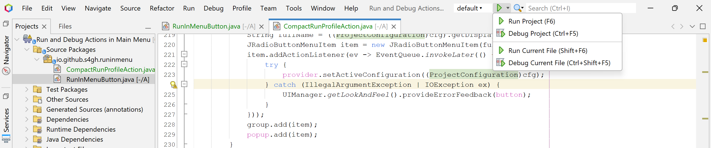
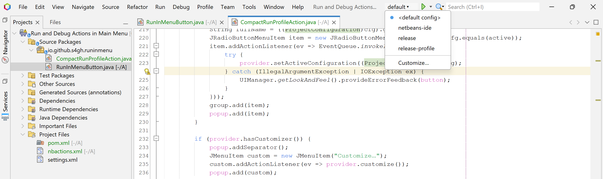
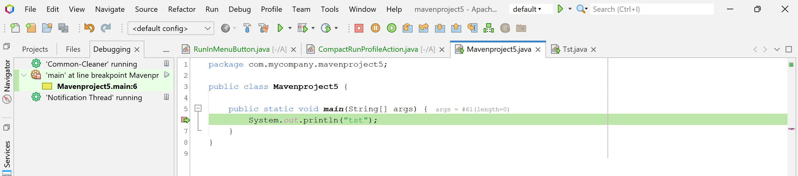

# Overview
Netbeans IDE plugin with actions to run and debug placed into main menu.

Don't use NetBeans main toolbar actoins to often and consider to hde toolbar to save vertical space.
But at the same time you'd like to have run and debug buttons available somewhere for quick access.
With this plugin you can hide main toolbar, put NetBeans menu into window title and add run and debug buttons in the window titlse.
Se screen shots below.

# Configuration
* Install plugin
* Put NetBeans menu into window title : `Tools->Options->Appearance->FlatLaf->Check "Window Decorations"->Check "Unified menu bar"->Check "Embedded menu bar"`
* Hide main toolbar : `View->Toolbars->uncheck everything`

# Screenshots
By clicking on the button in toolbar you run current projct with selectd profile. 

To access debug action as well as run and debug current file action use drop down next to run icon.

To select run profile use drop down close left to run button

When you start debug NetBeans automatically adds debug related buttons to the main tollbar (step opever, step into, etc).
It also makes toolbar with these buttons visible during debug. As soon as you stop debugging toolbar will hide automatically.

